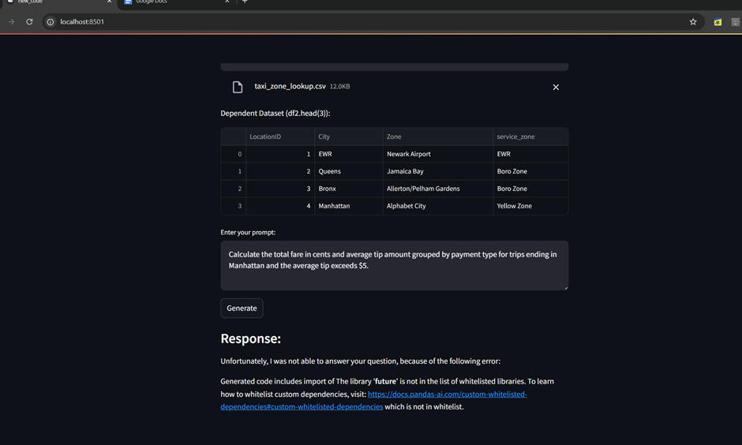

"# E_E_query_analytics" 

make sure we update pandas after requirements files are installed 
because the llm requests for lower versoin of pandas but pandasai requests for latest versoin of pandas.

pip install -U pandas

When we don’t white list the libraries then we face this issue

to resolve this we need to add the library to the below line

df1_sdf = SmartDataframe(df1, config={"llm": model,"custom_whitelisted_dependencies": ["scikit-learn","sqlalchemy","typing","io","pandasai","os","chr","glob","collections","sys","pathlib","future"     <><><><><>APPEND HERE<><><><><>],"security":"none","enable_cache":False})